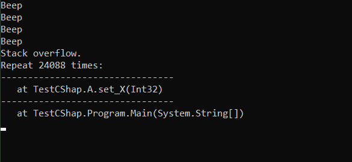

# Hey, welcome! 🌌

I am from Brazil, started learning programmation in 2018 with Java language, developing simple 2D games with it's native graphical API. Worked for some months, finished some simple projects, then i begun working with Javascript and all Web relationed technologies. For the next years I plan to masterize all my knowledges and learn more every time I finish learning the previous.

### Currently i work with:
+ Javascript
+ HTML
+ CSS
+ React.js
+ Node.js
+ Java
+ MongoDB
+ C/C++

### And will learn in future:
+ C#
+ Python
+ Pandas
+ Unity Engine
+ MySQL
+ PHP
+ Spring Boot
+ Bootstrap
+ Docker

### My profiles...
 |
 |
 |

#### Thanks for visiting!

